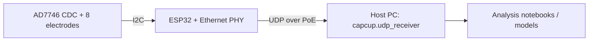
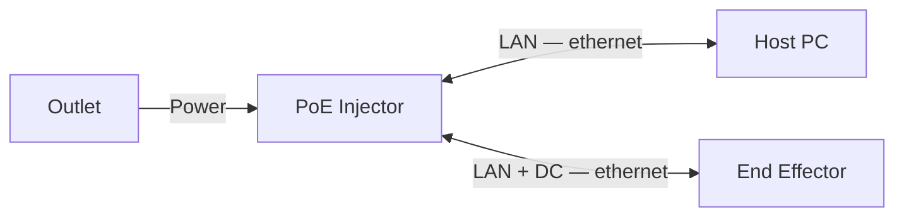

# smart-suction

Single source of truth for the smart suction cup project — a suction cup end
effector that senses contact and alignment from capacitance changes across
eight electrodes.

```
smart-suction/
├── hardware/   KiCad sources for the sense boards and interconnect PCBs
├── firmware/   ESP32 end-effector firmware
├── software/   live capture, analysis, models
└── docs/       diagrams and notes
```

Each part has its own README with setup and usage.

## How the pieces fit



The end effector (`firmware/`) samples eight capacitance channels and streams
40-byte UDP packets to a host PC. `software/` records them and runs the
analysis and position-estimation models.

## How to record data

You will need:

- 1x PoE injector
- 2x ethernet cables
- 1x computer with `software/` installed



Then, from `software/`, run `python -m capcup.udp_receiver -f my_capture`.
Two windows open: a rolling time-domain plot and a radial plot.


