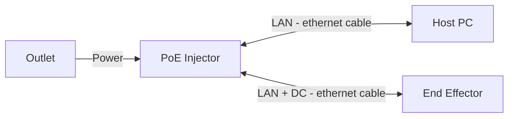
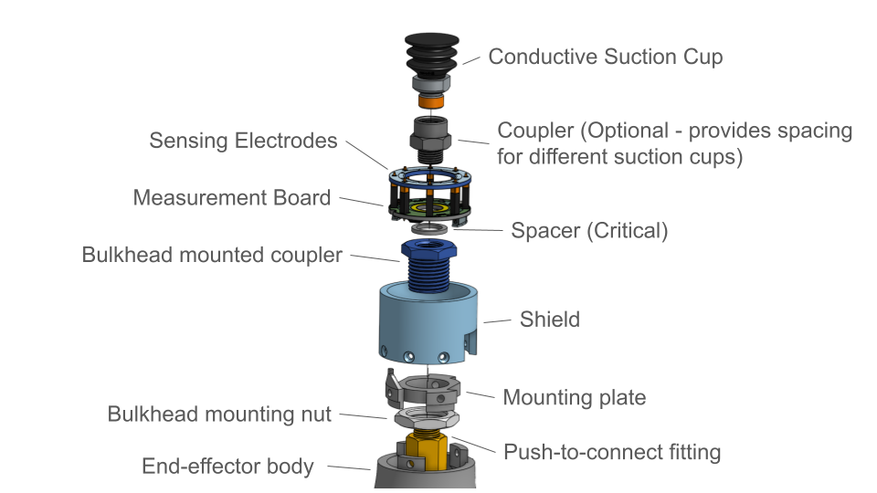

# smart-suction

Repository for evaluating data collected for the smart suction cup project.

# dev guide

Do the following commands in this directory.

- Upgrade pip `python -m pip install --upgrade pip`
- Initialize a python virtual environment `python -m venv [virtual environment name]`
- Activate the virtual environment
  - Windows `.\[virtual env name]\Scripts\activate`
  - Linux\OSX `source .\[virtual env name]\bin\activate`
- Install requirements `python -m pip install -r requirements.txt`
- Install this package in editable mode (for pytest and relative imports) `pip install -e .`

The structure of `src\smart-suction` should be identical to the structure of `tests\`, following the convention found [here](https://docs.pytest.org/en/stable/explanation/goodpractices.html#tests-outside-application-code).

Before pushing commits, you should run `pytest` in this directory to make sure all tests pass. If they don't, address them before pushing.

# how to record data

To record data off of a smart-suction end effector, you will need
- 1x PoE injector
- 2x ethernet cables
- 1x computer with this repo installed

They should be connected as follows

Then, run `python udp_receiver.py -f [FILENAME]` to record data (default will save to a file called `test.csv`). Two windows will pop-up, one with a rolling time domain plot, the other with a radial plot. 

## hardware

